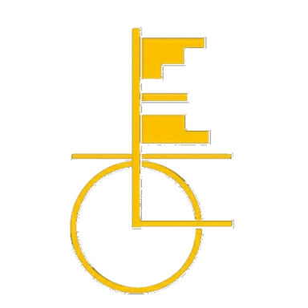

# 
 Let's Express Ourselves MVIT 

  
 

### Welcome to the Official  [Website of **L.E.O**](https://leomvit.com/) .
**L.E.O** is the official literary club of  **Sir M. Visvesvaraya Institute of Technology , Bangalore**.
* The website contains Poetries, Stories and a lot more.
* Join us by contributing and show your creativity. 
* * *

### Get involved :

1.  Fork the Repo ([LEO REPO](https://github.com/leomvit/leomvit.github.io)).
2.  Clone a copy of your fork on your local.
3.  Create a branch off of master and give it a meaningful name (e.g. my-new-feature).
4.  Make necessary changes, commit, push and open a pull request on GitHub.

           
* * * 
## Contributors

* * *
To know more about us : [Instagram](https://www.instagram.com/leo.mvit/)
